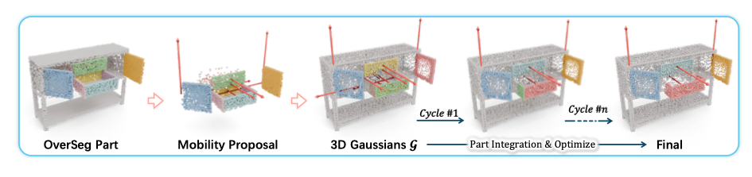

<div align="center">

# ArtPro: Self-Supervised Articulated Object Reconstruction with Adaptive Integration of Mobility Proposals

### CVPR 2026

<p>
  <a href="https://github.com/Tadori-izanai">Xuelu Li</a><sup>1*</sup>,
  <a href="https://zhaonan.wang/">Zhaonan Wang</a><sup>1*</sup>,
  <a href="https://cis.swu.edu.cn/info/1014/1206.htm">Xiaogang Wang</a><sup>2&dagger;</sup>,
  <a href="https://vr.sdu.edu.cn/info/1010/1061.htm">Lei Wu</a><sup>1</sup>,
  <a href="https://manyili12345.github.io/">Manyi Li</a><sup>1&dagger;</sup>,
  <a href="https://irc.cs.sdu.edu.cn/~chtu/index.html">Changhe Tu</a><sup>1</sup>
</p>

<p><sub>* indicates equal contribution &nbsp;&nbsp; &dagger; indicates corresponding author</sub></p>

<p><sup>1</sup>Shandong University &nbsp;&nbsp; <sup>2</sup>Southwest University</p>


[Paper](https://arxiv.org/pdf/2602.22666) | [Arxiv](https://arxiv.org/abs/2602.22666)
</div>
</div>



## Installation

The installation of ArtPro is similar to [3D Gaussian Splatting](https://github.com/graphdeco-inria/gaussian-splatting). Our default, provided install method is based on Conda package and environment management:
```bash
conda create -n artpro python=3.11
conda activate artpro

conda install -c conda-forge cuda=12.1.1 gxx_linux-64
pip install  torch==2.4.0 torchvision==0.19.0 torchaudio==2.4.0 --index-url https://download.pytorch.org/whl/cu121
pip install lightning "torch==2.4.0"

pip install -r requirements.txt

pip install submodules/simple-knn/ --no-build-isolation
pip install submodules/depth-diff-gaussian-rasterization/ --no-build-isolation

pip install torch_geometric
pip install pyg_lib torch_scatter torch_sparse torch_cluster torch_spline_conv -f https://data.pyg.org/whl/torch-2.4.0+cu121.html

conda install https://anaconda.org/pytorch3d/pytorch3d/0.7.8/download/linux-64/pytorch3d-0.7.8-py311_cu121_pyt240.tar.bz2
```

(Optional) If you want to process your own dataset, please download PartField's [checkpoint](https://huggingface.co/mikaelaangel/partfield-ckpt/blob/main/model_objaverse.ckpt) to `checkpoint/model_objaverse.ckpt`.

## Datasets

We provide the converted datasets used in our paper. You can directly train on our artpro, artgs and paris datasets available [here](https://1drv.ms/f/c/0baaa9bf56490a2c/IgB6GtXAWaZwR636TltZ3MZCAfm7gQGty6NSC53vZ_OQDyY?e=OYE8p9).

The data structure of ArtPro is shown as follows:
```
./datasets
    /artpro
        /table23372
            /start
                /partfield_features     # PartField Features of State=0
                /train                  # ⭐ RGBA Images
                /train_d                # ⭐ Depth Images
                transforms_train.json   # ⭐ Camera Parameters
                points3d.ply            # Reconstructed 3D Point Cloud
            /end
                /train                  # ⭐ RGBA Images
                /train_d                # ⭐ Depth Images
                transforms_train.json   # ⭐ Camera Parameters
                points3d.ply            # Reconstructed 3D Point Cloud
            /gt                         # Ground Truth Mesh and Motion
        ...
    /artgs
        ...
    /paris
        ...
```

If you want to use your own data, organize them in the above format. The items marked with ⭐ are required.

> Note: If `points3d.ply` is not provided, we will reconstruct it using rgbd. If testing a real scene, we recommend using a method (e.g. TSDF) to reconstruct a `points3d.ply`, which will be better than our default reconstruction method!

## Training

For our converted datasets, you can run the following script for training.
```bash
sh train_all.sh
```

After training, you can view the visualized final point cloud, `metrics.json`, part `pcd` and motion arrow `ply` in `./outputs/<dataset>/<scene>/clustering_<last>/`. We also visualized the initial information in `./<path>/clustering_0/`.

We also provide a script to export the current scene as a video. 
```bash
CUDA_VISIBLE_DEVICES=<gpu_id> python vis.py --num_movable 4 --model_path ./outputs_final/artpro/table34178 --data_path ./datasets/artpro/table34178 --view_idx 25
```

<video src="https://github.com/DyllanElliia/ArtPro/raw/main/video/v_outputs_final_artpro_table34178.mp4" controls width="40%">
  Oops...
</video>

Our eval code is based on [ArtGS](https://github.com/YuLiu-LY/ArtGS), thanks for the impressive open-source project!


## Processing your own Scenes

### Before getting started

Firstly, put your images and cameras into the `./datasets`. You need to acquire the following dataset format.
```
./datasets
    <your_scene>
        /start
            /train                  # ⭐ RGBA Images
            /train_d                # ⭐ Depth Images
            transforms_train.json   # ⭐ Camera Parameters
            points3d.ply            # Reconstructed 3D Point Cloud
        /end
            /train                  # ⭐ RGBA Images
            /train_d                # ⭐ Depth Images
            transforms_train.json   # ⭐ Camera Parameters
            points3d.ply            # Reconstructed 3D Point Cloud
```

If your data is similar to [ArtGS](https://github.com/YuLiu-LY/ArtGS) or [Paris](https://github.com/3dlg-hcvc/paris), you can use the converter provided in the `./converter` folder to convert data.

### Training

The training only needs to run the following command.
```bash
CUDA_VISIBLE_DEVICES=<gpu_id> python train.py --source ./datasets/<your_scene> --output outputs/<your_scene> --gt_movable_part <Enter a positive integer you like>
```

Our default parameters can handle most cases. If you find that the initialized segmentation has under-segmentation, you can set `--segment_level` to `medium` or `fine`. For some examples that are difficult to merge correctly, set the merging parameters to `--rel_tol 0.04 --tau_merge 1e-3`. Similarly, if the movable parts are small and prone to over-merging, we recommend setting the merging parameters to `--rel_tol 0.01 --tau_merge 1e-4`.

## Acknowledgement

Credits to the authors for their excellent contributions in the following works:
- [3D Gaussians](https://repo-sam.inria.fr/fungraph/3d-gaussian-splatting/)
- [ArtGS](https://github.com/YuLiu-LY/ArtGS)
- [Paris](https://github.com/3dlg-hcvc/paris)
- [DTA](https://github.com/NVlabs/DigitalTwinArt)
- [ArticulatedGS](https://github.com/GuoJunfu-tech/ArticulatedGaussians)
- [Sam2](https://github.com/facebookresearch/sam2)
- [PriorDA](https://github.com/SpatialVision/Prior-Depth-Anything)

## Citation

```
@inproceedings{li2026artpro,
  title={ArtPro: Self-Supervised Articulated Object Reconstruction with Adaptive Integration of Mobility Proposals},
  author={Li, Xuelu and Wang, Zhaonan and Wang, Xiaogang and Wu, Lei and Li, Manyi and Tu, Changhe},
  booktitle={Proceedings of the IEEE/CVF Conference on Computer Vision and Pattern Recognition},
  pages={13897--13907},
  year={2026}
}
```